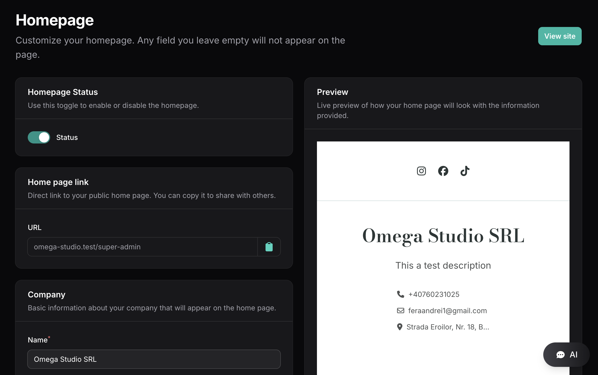

# Filament Page Preview


### Screenshots



Custom Filament form field that renders a Blade preview.

## Installation

Install the package via composer:

```bash
composer require ferarandrei1/filament-page-preview
```

## Usage

Use the `PreviewField` component in your Filament form:

```php
use Feraandrei1\FilamentPagePreview\Forms\Components\PreviewField;
use Filament\Forms\Form;

public function form(Form $form): Form
{
    return $form->schema([
        PreviewField::make('preview_field')
            ->previewData([
                'user' => Auth::user()->username,
                'previewRouteName' => 'preview',
                'data' => $data,
            ])
            ->nullable(),
    ]);
}
```

### Documentation

- **[Creating a Preview Route](docs/preview-route.md)** - Step-by-step guide to set up routes and controllers
- **[Complete Filament Page Example](docs/filament-page-example.md)** - Full example with two-column layout and live preview

### Custom Preview View

You can publish the views to customize them:

```bash
php artisan vendor:publish --tag=filament-page-preview-views
```

Or, you can specify a custom view for the preview:

```php
PreviewField::make('preview_field')
    ->previewView('filament.view-fields.custom-preview')
    ->previewData(['key' => 'value']);
```

## Requirements

- PHP 8.1 or higher
- Filament 3.0 or higher
- Laravel 10.0 or higher

## License

MIT License
